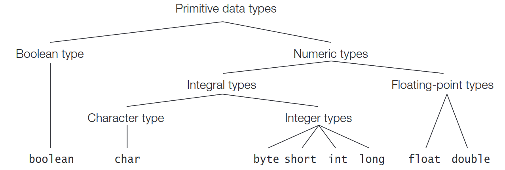
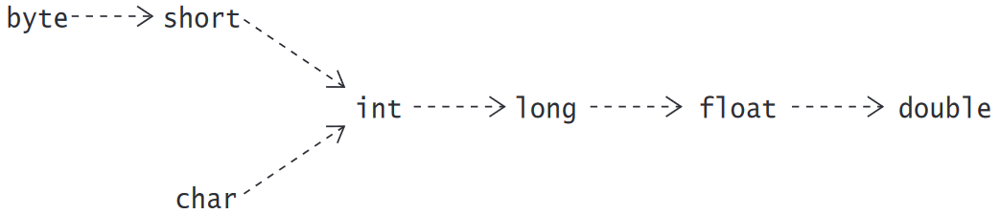

# Basic Elements, Primitive Data Types, and Operators

## Basic Language Elements

* **_identifier_** is composed of a sequence of characters, where each character can be either a **_letter_** or a **_digit_**.
* the first character in an identifier must always be a letter.
* the characters **_A to Z_** and **_a to z_** are letters and the characters **_0 to 9_** are digits
* A connecting punctuation character (such as underscore _) and any currency symbol (such as $, ¢, ¥, or £) are also allowed as letters in identifier names
* the underscore (_) on its own is not a legal identifier name, but a keyword
* Examples of Legal Identifiers
    * Legal: `number, Number, sum_$, bingo, $$_100, _007, mål, grüß`
    * Illegal: `48chevy, all@hands, grand-sum, _`
* All Java keywords are lowercase, and incorrect usage results in compile-time errors.
* A keyword cannot be used as an identifier.
* A **_literal_** denotes a constant value
* `Integer` data types comprise the following primitive data types: `int`, `long`, `byte`, and  `short`
* –N<sub>2</sub> = ~N<sub>2</sub> + 1 , 0 = –N<sub>2</sub> + N and N<sub>2</sub> – M<sub>2</sub> = N<sub>2</sub> + (–M<sub>2</sub>)
* **_Floating-point_** data types come in two flavors: `float` and `double` and their decimal point and the exponent are optional
* The underscore character (_) can be used to improve the readability of numerical literals, yet it can't be adjacent to:
    * sign (+, -)
    * the radix prefix (0b, 0B, 0x, 0X)
    * the decimal point (.)
    * the exponent (e, E)
    * the data type suffix (l, L, d, D, f, F)
    * before the first digit and after the last digit.
* A character literal is quoted in single quotes (`'`)
* Most used Character literals and their Unicode:
    * `'A' = '\u0041' corresponds to 65 in ASCII`
    * `'Z' = '\u005a' corresponds to 90 in ASCII`
    * `'a' = '\u0061' corresponds to 97 in ASCII`
    * `'z' = '\u007a' corresponds to 122 in ASCII`
* A string literal is a sequence of characters that must be enclosed in double quotes and must occur on a single line.
* All string literals are objects of the class `String`

## Primitive Data Types



* Primitive data values are not objects, but each primitive data type has a corresponding _**wrapper**_ class that can be used to represent a primitive value as an object.

| Data type |  Width (bits)  |             Minimum value, maximum value              | Wrapper class |
|:---------:|:--------------:|:-----------------------------------------------------:|:-------------:|
| `boolean` | Not applicable |                      true, false                      |   `Boolean`   |
|  `byte`   |       8        |           –2<sup>7</sup>, 2<sup>7</sup> – 1           |    `Byte`     |
|  `short`  |       16       |           –2<sup>15</sup>, 2<sup>15</sup>-1           |    `Short`    |
|  `char`   |       16       |                      0x0, 0xfff                       |  `Character`  |
|   `int`   |       32       |           –2<sup>31</sup>, 2<sup>31</sup>-1           |   `Integer`   |
|  `long`   |       64       |           –2<sup>63</sup>, 2<sup>63</sup>-1           |    `Long`     |
|  `float`  |       32       | ±1.40129846432481707e-45f, ±3.402823476638528860e+38f |    `Float`    |
| `double`  |       64       | ±4.94065645841246544e-324, ±1.79769313486231570e+308  |   `Double`    |

## Conversions

* For the primitive data types, the value of a narrower data type can be converted to a value of a wider data type.

### Widening Primitive Conversions



* conversions between char and the two integer types byte and short are considered narrowing primitive conversions
* These narrowing conversions are done in two steps: first converting the source value to the `int` type, and then converting the `int` value to the target type
* Regardless of any loss of magnitude or precision, widening and narrowing primitive conversions never result in a runtime exception.
* Conversions **_up_** the **_type hierarchy_** are called **_widening reference conversions_** (also called **_upcasting_**). Such a conversion converts from a subtype to a supertype
* The compiler will reject casts that are not legal or will issue an unchecked warning under certain circumstances if type-safety cannot be guaranteed
* Widening reference conversions do not require any runtime checks and never result in an exception during execution.
* This is not the case for narrowing reference conversions, which require a runtime check and can throw a `ClassCastException` if the conversion is not legal.
* Unboxing a wrapper reference that has the null value results in a `NullPointerException`

```java
Integer iRef = 10; // (1) Implicit boxing: Integer <----- int
Double dRef = Double.valueOf(3.14); // (2) Explicit boxing: Double <----- double
int i = iRef; // (3) Implicit unboxing: int <----- Integer
double d = dRef.doubleValue(); // (4) Explicit unboxing: double <----- Double
```

## Type Conversion Contexts

### Assignment Context

* An assignment conversion converts the type of expression to the type of target variable.
* An expression (or its value) is **_assignable_** to the target variable, if the type of the expression can be converted to the type of the target variable by an assignment conversion.
  Equivalently,the type of the expression is **_assignment compatible_** with the type of the target variable `byte b = 10; // Narrowing conversion: byte <--- int`

### Method Invocation Context

* Method invocation conversions do not include the implicit narrowing conversion performed for non-long integral constant expressions

```java
// Assignment: (1) Implicit narrowing followed by (2) boxing.
Character space1 = 32; // Character <-(2)-- char <-(1)-- int

// Invocation of method with signature: valueOf(char)
// Call signature: valueOf(int)
Character space2 = Character.valueOf(32); // Compile-time error!

// Call signature: valueOf(char)
Character space3 = Character.valueOf(( char ) 32); // OK!
```

### Casting Context of the Unary Type Cast Operator (type)

* Java, being a **_strongly typed_** language, checks for type **_compatibility_** at compile time.
* Some checks are possible only at runtime (e.g., which type of object a reference actually denotes during execution).
* At runtime, a cast results in a new value of type, which best represents the value of the expression in the old type.
* Casting can be applied to primitive values as well as references. Casting between primitive data types and reference types is not permitted, except where boxing and unboxing is applicable.
* Boolean values cannot be cast to other data values, and vice versa.
* The reference literal `null` can be cast to any reference type.

### Numeric Promotion Context

* **_unary numeric promotion results in an operand value that is either int or wider_**
* Unary numeric promotion proceeds as follows:
    * If the single operand is of type `Byte`, `Short`, `Character`, or `Integer`, it is unboxed. If the resulting value is narrower than `int`, it is promoted to a value of type `int` by a widening
      conversion.
    * Otherwise, if the single operand is of type `Long`, `Float`, or `Double`, it is unboxed.
    * Otherwise, if the single operand is of a type narrower than `int`, its value is promoted to a value of type `int` by a widening conversion.
    * Otherwise, the operand remains unchanged.
* Unary numeric promotion is applied in the following expressions:
    * Operand of the unary arithmetic operators + and -
    * Array creation expression; for example, `new int[20]`, where the dimension expression (in this case, 20) must evaluate to an `int` value
    * Indexing array elements; for example, objArray['a'], where the index expression (in this case, 'a') must evaluate to an int value
* Binary numeric promotion implicitly applies appropriate widening primitive conversions so that the widest numeric type of a pair of operands is always at least `int`
* **_This means that the resulting type of the operands is at least int_**
* Binary numeric promotion is applied in the following expressions:
    * Operands of the arithmetic operators *, /, %, +, and -
    * Operands of the relational operators <, <=, >, and >=
    * Operands of the numerical equality operators == and !=
    * Operands of the conditional operator ? :, under certain circumstances

## Precedence and Associativity Rules for Operators

* The following remarks apply to Table:
    * The operators are shown with decreasing precedence
    * Operators within the same row have the same precedence
    * Parentheses, (), can be used to override precedence and associativity
    * The unary operators, which require one operand
    * **_All binary operators, except for the relational and assignment operators, associate from left to right. The relational operators are non-associative_**
    * Except for unary postfix increment and decrement operators, all unary operators, all assignment operators, and the ternary conditional operator associate from right to left

|                         Type                         |                       Operator                        |
|:----------------------------------------------------:|:-----------------------------------------------------:|
| Array element access,member access,method invocation |                 [expression] . (args)                 |
|               Unary postfix operators                |               expression++ expression--               |
|                Unary prefix operators                | ~ ! ++expression --expression +expression -expression |
|            Unary prefix creation and cast            |                      new (type)                       |
|                    Multiplicative                    |                         * / %                         |
|                       Additive                       |                          + -                          |
|                        Shift                         |                       << >> >>>                       |
|                      Relational                      |                 < <= > >= instanceof                  |
|                       Equality                       |                         == !=                         |
|                 Bitwise/logical AND                  |                           &                           |
|                 Bitwise/logical XOR                  |                           ^                           |
|                  Bitwise/logical OR                  |                          \|                           |
|                   Conditional AND                    |                          &&                           |
|                    Conditional OR                    |                         \|\|                          |
|                     Conditional                      |                          ?:                           |
|                    Arrow operator                    |                          ->                           |
|                      Assignment                      |        = += -= *= /= %= <<= >>= >>>= &= ^= \|=        |

* Java guarantees that all operands of an operator are fully evaluated before the actual operation is performed. This rule does not apply to the short-circuit conditional operators &&, ||, and ?:.

## The Simple Assignment Operator =

* `variable = expression` **_the target, variable, gets the value of the source, expression_**
* Assigning a reference value does not create a copy of the source object denoted by the reference variable on the right-hand side
* `int v1 = v2 = 2016; // Only v1 is declared. Compile-time error!`
* A constant expression is an expression that denotes either a primitive or a String literal. it is composed of operands that can be only literals or constant variables, and operators that can be
  evaluated only at compile time (e.g., arithmetic and numerical comparison operators, but not increment/decrement operators and method calls).
* A constant variable is a final variable of either a primitive type or the String type that is initialized with a constant expression

```java
public static void main(String... args) {
    final char finalGrade = 'A'; // Constant variable. ’A’
    int        result     = 100; // Not a constant variable. Not declared final.
    System.out.printf("%d%n%s%n%d%n%.2f%n%b%n%d%n%d%n",
                      2022, // Constant expression. 2022
                      "Trust " + "me!", // Constant expression. "Trust me"
                      2 + 3 * 4, // Constant expression. 14
                      Math.PI * Math.PI * 10.0, // Constant expression. 98.70
                      finalGrade == 'A', // Constant expression. true
                      Math.min(2020, 2021), // Not constant expression. Method call.
                      ++result // Not constant expression. Increment operator.
                     );
}
```

```java
  // Conditions fulfilled for implicit narrowing primitive conversions.
final int i1 = 20; // Constant variable
short s1 = 10; // int value in range.
short s2 = 'a'; // char value in range.
char c1 = 32; // int value in range.
char c2 = ( byte ) 35; // byte value in range. (int value in range, without cast.)
byte b1 = 40; // int value in range.
byte b2 = ( short ) 40; // short value in range. (int value in range, without cast.)
byte b3 = i1; // final value of i1 in range.
```

```java
void test() {
    final int i4 = 200; // i4 is a constant variable.
    final int i5; // i5 is not a constant variable.
// Conditions not fulfilled for implicit narrowing primitive conversions.
// A cast is required.
    int       i2 = -20; // i2 is not a constant variable. i2 is not final.
    final int i3 = i2; // i3 is not a constant variable, since i2 is not.
    char      c3 = ( char ) i3; // Final value of i3 not determinable at compile time.
    short     s3 = ( short ) i2; // Not constant expression.
    char      c4 = ( char ) i2; // Not constant expression.
    byte      b4 = ( byte ) 128; // int value not in range.
    byte      b5 = ( byte ) i4; // Value of constant variable i4 is not in range.
    i5 = 100; // Initialized at runtime.
    short s4 = ( short ) i5; // Final value of i5 not determinable at compile time.
}
```

## Arithmetic Operators: *, /, %, +, -

* If evaluation of an operand results in an error, the subsequent operands will not be evaluated
* Integer arithmetic always returns a value that is in range, except in the case of integer division by zero and remainder by zero, which cause an `ArithmeticException`
* Both positive and negative infinity represent overflow to infinity; that is, the value is too large to be represented as a `double` or `float`
* Attempting floating-point division by zero also returns infinity.
* Floating-point arithmetic can also result in underflow to zero, when the value is too small to be represented as a `double` or `float`

```java
void test() {
    System.out.println(4.0 / 0.0); // Prints: Infinity which is equal to Double.POSITIVE_INFINITY
    System.out.println(-4.0 / 0.0); // Prints: -Infinity which is equal to Double.NEGATIVE_INFINITY
    System.out.println(0.0 / 0.0); // Prints: NaN
    System.out.println(Math.sqrt(-1)); // Prints: NaN which is equal to Double.NaN
}
```

* Any operation involving `NaN` produces `NaN`.
* Any comparison (except inequality, `!=`) involving `NaN` and any other value (including `NaN`) returns `false`
* An inequality comparison of NaN with another value (including `NaN`) always returns `true`
* the recommended way of checking a value for `NaN` is to use the static method `isNaN()` defined in both wrapper classes, `java.lang.Float` and `java.lang.Double`.
* Decrementing or Incrementing a literal would result in a compile-time
* `ArithmeticException` is thrown when integer division with zero is attempted
* compound assignment operator has the following syntax: `variable op= expression` and the following semantics `variable = (type) ((variable) op (expression))`

### Arithmetic Compound Assignment Operators

| Expression | Given T as the numeric type of x, the expression is evaluated as: |
|:----------:|:-----------------------------------------------------------------:|
|  `x *= a`  |                       `x = (T) ((x) * (a))`                       |
|  `x /= a`  |                       `x = (T) ((x) / (a))`                       |
|  `x %= a`  |                       `x = (T) ((x) % (a))`                       |
|  `x += a`  |                       `x = (T) ((x) + (a))`                       |
|  `x -= a`  |                       `x = (T) ((x) - (a))`                       |

## The Binary String Concatenation Operator +

* When one of the operands is a `String` object a string concatenation is performed rather than numeric addition and results in a newly created `String` object
* Creation of temporary `String` objects might be necessary to store the results of performing successive string concatenations in a **_String-valued expression_**.
* For a **_String-valued constant expression_** the compiler computes such an expression at compile time, and the result is treated as a string literal in the program.
* The compiler uses a **_string builder_** to avoid the overhead of temporary String objects when applying the string concatenation operator (+) in String-valued non-constant expressions

## Variable Increment and Decrement Operators: ++, --

* These operators cannot be applied to a variable that is declared final and that has been initialized, as the side effect would change the value in such a variable
* The prefix increment operator has the following semantics: `++i` adds `1` to the value in `i`, and stores the new value in `i`. It returns the `new` value as the value of the expression.

```java
void test() {
    i += 1;
    result = i;
    return result;
}
```

* The postfix increment operator has the following semantics: `j++` adds `1` to the value in `j`, and stores the new value in `j`. It returns the original value that was in `j` as the value of the
  expression

```java
void test() {
    result = j;
    j += 1;
    return result;
}
```

* The prefix decrement operator has the following semantics: `--i` subtracts `1` from the value of `i`, and stores the `new` value in `i`. It returns the `new` value as the value of the expression.

```java
void test() {
    i -= 1;
    result = i;
    return result;
}
```

* The postfix decrement operator has the following semantics: `j--` subtracts `1` from the value of `j`, and stores the `new` value in `j`. It returns the original value that was in `j` as the value
  of the
  expression

```java
void test() {
    result = j;
    j -= 1;
    return result;
}
```

* We cannot associate increment and decrement operators. Given that `a` is a variable, we cannot write `(++(++a))`. The reason is that any operand to `++` must evaluate to a variable, but the
  evaluation of `(++a)` results in a value.

## Relational Operators: <, <=, >, >=

* All relational operators are binary operators and their operands are numeric expressions. Binary numeric promotion is applied to the operands of these operators

```java
void test() {
    double  hours          = 45.5;
    Double  time           = 18.0; // Boxing of double value.
    boolean overtime       = hours >= 35; // true. Binary numeric promotion: double <-- int.
    boolean beforeMidnight = time < 24.0;// true. Unboxing of value in time reference.
    char    letterA        = 'A';
    boolean order          = letterA < 'a'; // true. Binary numeric promotion: int <-- char.
    
    //Relational operators are nonassociative
    int     a       = 1, b = 7, c = 10;
    boolean illegal = a <= b <= c; // (1) Illegal. Compile-time error!
    boolean valid2  = a <= b && b <= c; // (2) OK.
}
```

## Equality

### Primitive Data Value Equality: ==, !=

* Binary numeric promotion may be applied to the non-boolean operands of these equality operators

```java
int year = 2002;
boolean isEven = year % 2 == 0; // true.
boolean compare = '1' == 1; // false. Binary numeric promotion applied.
boolean test = compare == false; // true.
```

* `a == b == c` would proceed as follows: `((a == b) == c)`. Evaluation of `(a == b)`  would yield a boolean value that is permitted as an operand of a data value equality operator, but
  `(boolean value == c)`
  would be illegal if c had a numeric type

```java
int a, b, c;
a =b =c =5;
boolean illegal = a == b == c; // (1) Illegal.
boolean valid2 = a == b && b == c; // (2) Legal.
boolean valid3 = a == b == true; // (3) Legal.
```

### Object Reference Equality: ==, !=

* The equality operator `==` and the inequality operator `!=` can be applied to reference variables to test whether they refer to the same object
* The operands must be cast compatible otherwise a compile-time error will result as the reference value of one type cannot be cast to the other type.
* **_only when the type of both operands is either a **_reference type_** or the `null` type do these operators test for object reference equality. Otherwise, they test for primitive data equality_**

### Object Value Equality

* The Object class provides the method `public boolean equals(Object obj)`, which can be overridden to give the right semantics of object value equality
* The default implementation of this method in the Object class returns true only if the object is compared with itself, as if the equality operator == had been used to compare aliases of an object
* if a class does not override the semantics of the equals() method from the Object class, object value equality is the same as object reference equality.

## Boolean Logical Operators: !, ^, &, |

* These operators can be applied to boolean or `Boolean` operands, returning a `boolean` value. The operators `&`, `|`, and `^` can also be applied to integral operands to perform bitwise logical
  operations

| Expression | Given a and b are of type boolean or Boolean, the expression is evaluated as: |
|:----------:|:-----------------------------------------------------------------------------:|
|  `b &= a`  |                                `b = (b & (a))`                                |
|  `b ^= a`  |                                `b = (b ^ (a))`                                |
| `b \|= a`  |                               `b = (b \| (a))`                                |

## Conditional Operators: &&, ||

* Short-circuit evaluation can be used to ensure that a reference variable denotes an object before it is used `if (objRef != null && objRef.equals(other)) { /*...*/ }`

## Integer Bitwise Operators: ~, &, |, ^

* Unary numeric promotion is applied to the operand of the unary bitwise complement operator `~`
* binary numeric promotion is applied to the operands of the binary bitwise operators.
* The result is a new integer value of the promoted type, which can be either `int` or `long`
* `Integer.toBinaryString(result)` and `Integer.toHexString(result)`

## Shift Operators: <<, >>, >>>

* Since `char`, `byte`, and `short` operands are promoted to `int`, the result of applying these bitwise operators is always either an `int` or a `long` value
* Each left-shift corresponds to multiplication of the value by 2
* Each right-shift corresponds to integer division of the value by 2

## Other Operators: new, [], instanceof, ->

* The new operator is used to create objects, such as instances of classes and arrays. It is used with a constructor call to instantiate classes

```java
Pizza myPizza = new Pizza();
boolean test1 = myPizza instanceof Pizza; // true.
boolean test2 = "Pizza" instanceof Pizza; // Compile-time error. Incompatible
// operand types.
boolean test3 = null instanceof Pizza; // Always false. null is not an instance.
```
