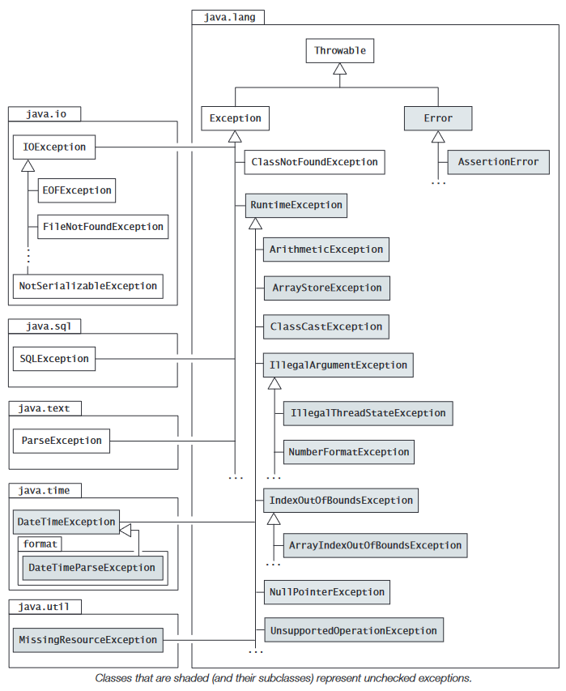

<!-- TOC -->

* [Exception Handling](#exception-handling)
    * [Stack-Based Execution and Exception Propagation](#stack-based-execution-and-exception-propagation)
    * [Exception Types](#exception-types)
        * [The `java.lang.Exception` Class](#the-javalangexception-class)
        * [The `java.lang.RuntimeException` Class](#the-javalangruntimeexception-class)
        * [The `java.lang.Error` Class](#the-javalangerror-class)
    * [Checked and Unchecked Exceptions](#checked-and-unchecked-exceptions)
    * [Defining Customized Exceptions](#defining-customized-exceptions)
    * [Exception Handling: `try`, `catch`, and `finally`](#exception-handling-try-catch-and-finally)
        * [The `try` Block](#the-try-block)
        * [The `catch` Clause](#the-catch-clause)
        * [The `finally` Clause](#the-finally-clause)
    * [The `throws` Clause](#the-throws-clause)
        * [Overriding the `throws` Clause](#overriding-the-throws-clause)
            * [Comparing Checked and Unchecked Exceptions](#comparing-checked-and-unchecked-exceptions)
    * [The Multi-`catch` Clause](#the-multi-catch-clause)
        * [Rethrowing Exceptions](#rethrowing-exceptions)
        * [Chaining Exceptions](#chaining-exceptions)
    * [The `try`-with-resources Statement](#the-try-with-resources-statement)
        * [Implementing the `AutoCloseable` Interface](#implementing-the-autocloseable-interface)
        * [Suppressed Exceptions](#suppressed-exceptions)

<!-- TOC -->
----

# Exception Handling

## Stack-Based Execution and Exception Propagation

- Several threads can be executing at the same time in the JVM. Each thread has its own JVM stack (also called a runtime stack, call stack, or invocation stack in the literature) that is used to handle execution of methods
- Each element on the stack is called an activation frame or a stack frame and corresponds to a method call
- Each new method call results in a new activation frame being pushed on the stack, which stores all the pertinent information such as the local variables
- The method with the activation frame on the top of the stack is the one currently executing

## Exception Types

- All throwable classes in the Java SE Platform API at least define a zero-argument constructor and a one-argument constructor that takes a String parameter



```java
Throwable();//Method Signature

Throwable(String msg);//Method Signature
```

### The `java.lang.Exception` Class

- The class `Exception` represents exceptions that a program would normally want to catch.
- subclasses of the `Exception` class, excluding the `RuntimeException` class, define what are known as **_checked exceptions_**.Some common checked exceptions are presented below:
- `java.lang.ClassNotFoundException`
    - The class `ClassNotFoundException` is a subclass of the `Exception` class that signals that the JVM tried to load a class by its string name, but the class could not be found
- `java.io.EOFException`
    - The class `EOFException` is a subclass of the `IOException` class that represents an exception that signals that an **_end of file (EOF)_** or end of stream was reached unexpectedly when more input was expected—that is, there is no more input available
- `java.io.FileNotFoundException`, `java.io.IOException`, `java.io.NotSerializableException` and `java.sql.SQLException`

### The `java.lang.RuntimeException` Class

- Runtime exceptions are all subclasses of the `java.lang.RuntimeException` class, which is a subclass of the `Exception` class.
- As these runtime exceptions are usually caused by program bugs that should not occur in the first place, it is usually more appropriate to treat them as faults in the program design and let them be handled by the default exception handler
- `java.lang.ArithmeticException`
    - This exception represents situations where an illegal arithmetic operation is attempted, such as integer division by 0. It is typically thrown by the JVM
- `java.lang.ArrayIndexOutOfBoundsException`, `java.lang.ArrayStoreException`, `java.lang.ClassCastException`, `java.lang.IllegalArgumentException`, `java.lang.IllegalThreadStateException`, `java.lang.NumberFormatException` and java.lang.NullPointerException

### The `java.lang.Error` Class

- The class `Error` and its subclasses define errors that are invariably never explicitly caught and are usually **_irrecoverable_**
- The subclass VirtualMachineError represents virtual machine errors like stack overflow
  (`StackOverflowError`) and out of memory for object allocation (`OutOfMemoryError`). The subclass LinkageError represents class linkage errors like missing class definitions (`NoClassDefFoundError`).

## Checked and Unchecked Exceptions

- Except for `RuntimeException`, `Error`, and their subclasses, all exceptions are **_checked_** exceptions. The compiler ensures that if a method can throw a checked exception, directly or indirectly, the method must either catch the exception and take the appropriate action, or pass the exception on to its caller
- Exceptions defined by the Error and RuntimeException classes and their subclasses are known as unchecked exceptions, meaning that a method is not obliged to deal with these kinds of exceptions
- Either they are irrecoverable (exemplified by the Error class), in which case the program should not attempt to deal with them, or they are programming errors (exemplified by the RuntimeException class and its subclasses)

## Defining Customized Exceptions

- defined by either extending the Exception class or one of its checked subclasses, thereby making the new exceptions checked, or extending the RuntimeException subclass or one of its subclasses to create new unchecked exceptions

## Exception Handling: `try`, `catch`, and `finally`

- For each `try` block, there can be zero or more `catch` clauses (i.e., it can have multiple `catch` clauses), but only one `finally` clause.
- The `catch` clauses and the `finally` clause must always appear in conjunction with a `try` block, and in the right order
- A `try` block must be followed by at least one `catch` clause, or a `finally` clause must be specified—in contrast to the `try`-with-resources statement where neither a `catch` nor a `finally` clause is mandatory
- A `finally` clause is always executed, regardless of the cause of exit from the `try` block, or whether any `catch` clause was executed at all. The two exceptions to this scenario are if the JVM crashes or the `System.exit()` method is called

### The `try` Block

- The `catch` clauses are skipped for all normal exits from the `try` block when no exceptions are thrown, and control is transferred to the `finally` clause if one is specified

### The `catch` Clause

- The code of the first such catch clause is executed, and all other catch clauses are ignored
- It is important to note that after a `catch` clause has been executed, control is always transferred to the `finally` clause if one is specified
- The `javac` compiler complains if a `catch` clause for a superclass exception shadows the `catch` clause for a subclass exception, as the `catch` clause of the subclass exception will never be executed (a situation known as **_unreachable code_**)

```java
void test() {
    try {
        // ...
    } catch (Exception e) { // (1) Superclass shadows subclass
        System.out.println(e);
    } catch (ArithmeticException e) { // (2) Compile-time error: Unreachable code
        System.out.println(e);
    }
}
```

- The compiler will also flag an error if the parameter of the `catch` clause has a **_checked_** exception type that cannot be thrown by the `try` block, as this would result in unreachable code

```java
void test() {
    try {
        throw new ArithmeticException(); // IOException never thrown in try block
    } catch (IOException e) { // Compile-time error: Unreachable code
        System.out.println(e);
    }
}
```

### The `finally` Clause

- a value returned by a `return` statement in the `finally` clause will supersede any value returned by a `return` statement in the `try` block or a `catch` clause
- If the `finally` clause throws an exception, this exception is propagated with all its ramifications—regardless of how the `try` block or any `catch` clause was executed. In particular, the new exception overrules any previously uncaught exception

## The `throws` Clause

- A `throws` clause can be specified in a method or a constructor header to declare any **_checked_** exceptions that can be thrown by a statement in the body of a method or a constructor.
- The compiler enforces that if a checked exception can be thrown from the body of the method or the constructor, then either the type of this exception or a supertype of its exception type is specified in the throws clause of the method or the constructor
- The throws clause can specify unchecked exceptions, but this is seldom done and the compiler does not enforce any restrictions on their usage.
- In a method or a constructor, a checked exception can be thrown directly by a throw statement, or indirectly by calling other methods or constructors that can throw a checked exception. If a checked exception is thrown, the code must obey the following rule (known by various names: catch-or-declare rule, handle-or-declare rule, catch-or-specify requirement):
    - Either use a try block and catch the checked exception in a catch block and deal with it
    - Or explicitly allow propagation of the checked exception to its caller by declaring it in the throws clause
- If a method or a constructor can throw a checked exception, then the `throws` clause must declare its exception type or a supertype of its exception type; otherwise, a compile-time error will occur
- This would also entail that the `main()` method either `catch` an `Exception` or declare it in a `throws` clause

### Overriding the `throws` Clause

- The method declaration in the subclass need not specify a `throws` clause if it does not throw any **_checked_** exceptions, and if it does, it can specify **_only checked exception_** classes that are already in the throws clause of the superclass method, or that are **_subclasses of the checked exceptions_** in the `throws` clause of the superclass method
- As a consequence, an overriding method can have more number of exceptions, but it cannot allow broader checked exceptions in its throws clause than the superclass method does.
- there are no restrictions on specifying unchecked exceptions in the throws clause of the overriding method

#### Comparing Checked and Unchecked Exceptions

|           Context           |                                                         Checked exceptions                                                          |                               Unchecked exceptions                                |
|:---------------------------:|:-----------------------------------------------------------------------------------------------------------------------------------:|:---------------------------------------------------------------------------------:|
|     The `throws` clause     |                   Can include any checked exception, but when overridden it cannot specify new checked exceptions                   |       Can include any unchecked exception, whether it is overridden or not        |
|       The `try` block       |                                                  Can `throw` any checked exception                                                  |                        Can `throw` any unchecked exception                        |
|     The `catch` clause      | Can only catch a checked exception that is thrown by the `try` block. A `catch` clause can always be used to `catch` an `Exception` | Can catch any unchecked exception, whether or not it is thrown by the `try` block |
|    The `throw` statement    |                                                   Can throw any checked exception                                                   |                         Can throw any unchecked exception                         |
| The _catch-or-declare_ rule |                                                 Applies only to checked exceptions                                                  |                      Does not apply to unchecked exceptions                       |

## The Multi-`catch` Clause

- specific exceptions are to be preferred over general exceptions, not the least because a more general exception type might unintentionally catch more exceptions than intended
- There should be no subtype–supertype relationship between any of the specified exception types in the alternatives of a multi-catch clause
- The parameter of a multi-catch clause is also considered to be implicitly final, and therefore cannot be assigned to in the body of the multi-catch clause
- In a uni-catch clause, the parameter is considered to be effectively final if it does not occur on the left-hand side of an assignment in the body of the uni-catch clause

```java
void test() {
    try {
        // Assume appropriate code to throw the right exceptions.
    } catch (NumberFormatException | IndexOutOfBoundsException e) { // Parameter is final.
        e = new ArrayIndexOutOfBoundsException();// Compile-time error! Cannot assign to final parameter e.
    } catch (IntegerDivisionByZero idbz) { // Parameter is effectively final.
        idbz.printStackTrace();
    } catch (IOException ioe) { // Parameter is not effectively final.
        ioe = new FileNotFoundException("No file.");
    }
}
```

- The compiler also generates effective bytecode for a single exception handler corresponding to all the alternatives in a multi-catch clause, in contrast to generating bytecode for multiple exception handlers for uni-catch clauses that correspond to the multi-catch clause

### Rethrowing Exceptions

- The throws clause must specify the same type as the type of the catch parameter
- In summary, a throw statement in the body of a catch clause can throw a final or an effectively final exception parameter that has exception type E if all the following conditions are satisfied:
    - Exception type E can be thrown in the body of the try statement with which the catch clause is associated
    - Exception type E is assignment compatible with any of the exception types declared for the parameter in the catch clause
    - Exception type E is not assignment compatible with any of the exception types declared for the parameters in any preceding catch clause in the same try statement

### Chaining Exceptions

- It is common that the handling of an exception leads to the throwing of another exception. In fact, the first exception is the cause of the second exception being thrown. Knowing the cause of an exception can be useful, for example, when debugging the application

```java
Throwable(Throwable cause)

Throwable(String msg, Throwable cause)

Throwable initCause(Throwable cause)

Throwable getCause()
```

```java
import java.io.EOFException;
import java.io.FileNotFoundException;
import java.io.IOException;

public class ExceptionsInChain {
    public static void main(String[] args) {
        try {
            chainIt();
        } catch (Exception e) { // (1)
            System.out.println("Exception chain: " + e);
            Throwable t = e.getCause();
            while (t != null) {
                System.out.println("Cause: " + t);
                t = t.getCause();
            }
        }
    }

    public static void chainIt() throws Exception { // (2)
        try {
            throw new FileNotFoundException("File not found");
        } catch (FileNotFoundException e) {
            try {
                IOException ioe = new IOException("File error");
                ioe.initCause(e); // (3)
                throw ioe;
            } catch (IOException ioe) {
                Exception ee = new Exception("I/O error", ioe); // (4)
                throw ee;
            }
        }
    }
}
```

## The `try`-with-resources Statement

- Normally, objects in Java are automatically garbage collected at the discretion of the JVM when they are no longer in use. However, resources are objects that need to be explicitly closed when they are no longer needed. Files, streams, and database connections are all examples that fall into this category of objects
- The `close()` method is only called on the `BufferedReader` object, and not on the `FileReader` object. The reason is that the `close()` method of the `BufferedReader` object implicitly calls the `close()` method of the `FileReader` object associated with it.
- This is typical of how the `close()` method of such resources works. Also, calling the `close()` method on a resource that has already been closed normally has no effect; the `close()` method is said to be _idempotent_

```java
try(var fis = new FileReader(args[0]);
var br = new BufferedReader(fis)){}
```

- the resource variables are implicitly final, guaranteeing that they cannot be assigned to in the try block, thus ensuring that the right resources will be closed when the `close()` method is called after the execution of the try block

### Implementing the `AutoCloseable` Interface

- after the close() method has been called on the resource—any catch clauses and finally clause explicitly specified with an extended try-with-resources statement are executed after the declared resources have been closed.

### Suppressed Exceptions

- Exceptions thrown from the body of a try-with-resources statement are given preferential treatment over exceptions thrown by the close() method when called implicitly to close a declared resource
- Exceptions thrown in the try block pertain to the program logic and should not be masked, but at the same time any exceptions thrown in the close() method should not be ignored
- A solution is provided through _suppressed exceptions_. The class Throwable provides the following methods to handle such exceptions:

```java
void addSuppressed(Throwable exception)

Throwable[] getSuppressed()
```
